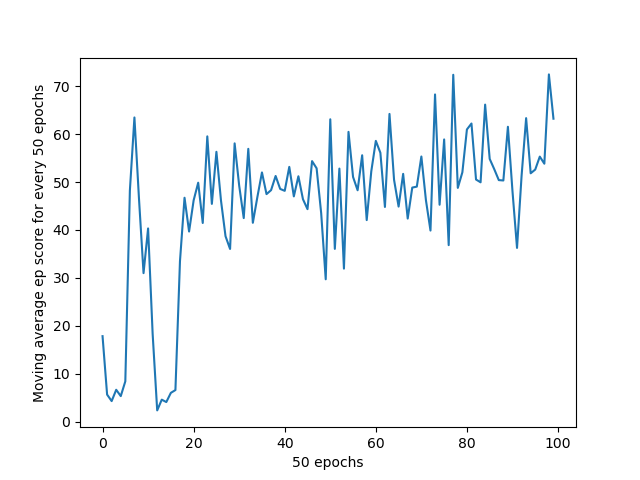
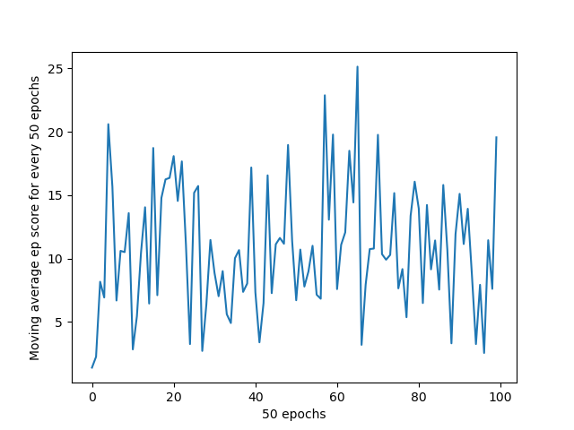

<div id="top"></div>

# Crossy Road AI Player


- [Crossy Road AI Player](#crossy-road-ai-player)
  - [Introduction](#introduction)
  - [Method](#method)
  - [Game State Design](#game-state-design)
  - [Reward Function](#reward-function)
  - [Results](#results)
  - [How to Run This Project](#how-to-run-this-project)
    - [Environment Setup](#environment-setup)
    - [Model Training](#model-training)
  - [License](#license)
  - [Credits](#credits)

## Introduction

Crossy Road is an arcade video game published by an Australian video game developer, Hipster Whale, on 20 November 2014. It is an endless and complex version of a traditional game Frogger, which has already had many RL research on it before. Being inspired by these previous projects, we are curious about how RL will work on Crossy Road. In our project, we are going to build an AI agent to control this game.

## Method

In this project, we implement three reinforcement learning algorithms, one is **Asynchronous Advantage Actor-Critic (A3C)**, the other one is **Double Deep Q-Network (DDQN)**, and the last one is **Proximal Policy Optimization (PPO)** (by Unity ML-Agent)

<p align="right">(<a href="#top">back to top</a>)</p>

## Game State Design

**Input**

The observational space is a 7 lines \* 21 blocks grid, i.e. there are seven road lines with each having 21 1m \* 1m blocks. It shows the relative positions of the player, the boundary, the cars, and the rivers. The player will always be put on the center of the map. In addition to the current line, the objects on the three lines ahead and the three lines behind would be observed.

**Output**

There are five ways to move the character, move forward, move backward, go left, go right, or wait. Each movement will make a step of 3m \* 3m block, and calling wait will let the character stay at the same place for 0.08 seconds before making the next decision. We set the actor space to be a vector representing these five actions.

Values of observational space (7 \* 21 GRID)

| Objects   | Value  |
| --------  | ------ |
| River	   |    2   |
| Car	      |    1   |
| Safe Spot	|    0   |
| Player	   |   -1   |
| Boundary	|   -2   |

Values od action space

| Actions    | Value  |
|  ----      | -----  |
| Wait       |	0      |
| Forward    |	1      |
| Backward   | 2      |
| Left       |	3      |
| Right      |	4      |

<p align="right">(<a href="#top">back to top</a>)</p>

## Reward Function

Status Reward
| Action State        | Reward |
| ------------------- | ------ |
| Beats high score    | 1      |
| Stuck on wall       | -0.5   |
| Player died         | -1     |

Episode end if not beating the highscore in 45 second or died.

<p align="right">(<a href="#top">back to top</a>)</p>

## Results

| Algorithm           | A3C                           | PPO                         | DDQN                            |
| ------------------- | ------------                  | ------------                | ------------                    |
| Time                | 5 hr 15 min                   | 3 hr 39 min                 |  1 hr 10 min                    |
| Iter                | 5000 (ep)                     | 250000 (step)               | 5000 (ep)                       |
| Max step            | 370                           | -                           | 213                             |
| Avg step            | 45.09                         | 31.63                       | 10.78                           |
| Plot                |  |      |   |

<p align="right">(<a href="#top">back to top</a>)</p>

## How to Run This Project

### Environment Setup

Run the following command under conda prompt,

```console
conda env create -f environment.yml -n CrossyRoad python=3.7
```

If there already exists a python 3.7 environment, one may run the following command instead

```console
pip install -r requirements.txt
```

### Model Training

1. The environment execution file is from the folder `EXE` of [Executable](https://github.com/Introduction-to-Machine-Learning-Team4/Executable)

2. Run the following command under conda prompt (replace \<mode\> by `a3c` or `ddqn`)

   ```console
   python train.py <mode>
   ```
<p align="right">(<a href="#top">back to top</a>)</p>

## License

Distributed under the MIT License. See `LICENSE` for more information.

<p align="right">(<a href="#top">back to top</a>)</p>


## Credits

+ Bo-Han, LAI ([@bob1113](https://github.com/bob1113))
+ Pei-Chi, HUANG ([@Peggy1210](https://github.com/Peggy1210))
+ Tsung-Han, YANG ([@TsungHanYang](https://github.com/TsungHanYang))
+ Yu-Hsiang, CHEN ([@ChenYuSean](https://github.com/ChenYuSean))
+ Special thanks to Fred Li for the provided computational ressources

<p align="right">(<a href="#top">back to top</a>)</p>